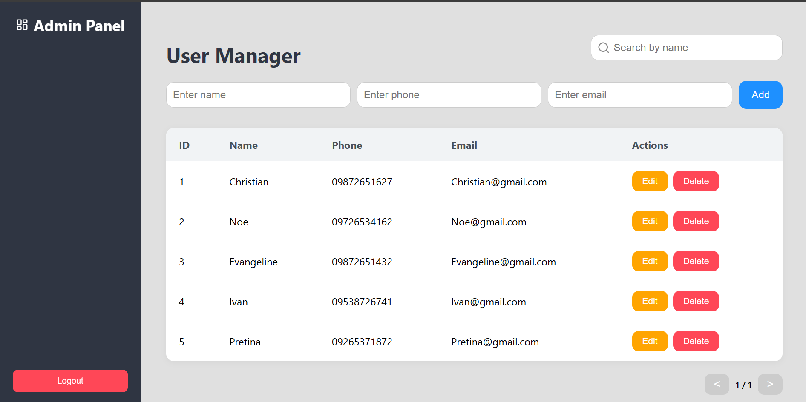
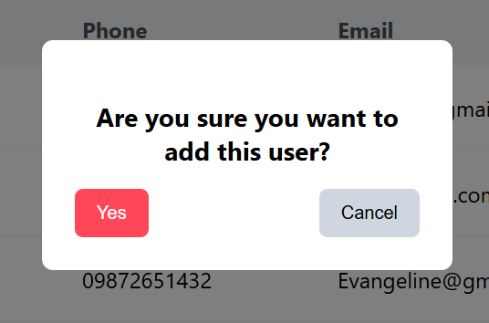

# CRUD-Personal-Project

A full-stack CRUD dashboard application built with:
- **Frontend:** React (Vercel)
- **Backend:** Flask (Render)
- **Database:** Supabase (PostgreSQL)

## 🚀 Live Demo
- **Frontend:** [Live App on Vercel](https://crud-personal-david.vercel.app/)
- **Backend API:** [Live API on Render](https://crud-backend-q5f8.onrender.com/)

## 📂 Repositories
- **Frontend Code:** [GitHub Repo](https://github.com/Chrisvid8/CRUD-Frontend)
- **Backend Code:** [GitHub Repo](https://github.com/Chrisvid8/CRUD-Backend)

## 📸 Screenshots

  
  

## 🛠️ Technologies Used
- **Frontend:** React, Axios
- **Backend:** Flask, SQLAlchemy, Flask-Migrate
- **Database:** Supabase (PostgreSQL)
- **Deployment:** Vercel (frontend), Render (backend)
